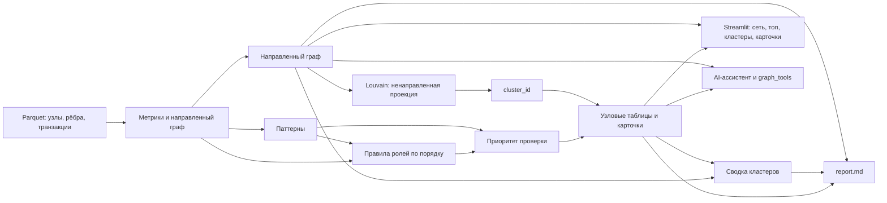

<p align="center">
  
</p>

# Граф денег — аналитика AML-сети

По исходящим переводам 81 известного seed-клиента строим сеть из 2 248 узлов и определяем наблюдаемые роли и паттерны.
Аналитик получает объяснимый приоритет проверки, карточки узлов, гипотезы по кластерам и перечень недостающих данных.
Это инструмент навигации по выборке: его выводы — признаки для проверки, а не оценка виновности.

> **Статус этой версии.** README описывает текущее состояние `main`. Пайплайн, выгрузки и локальный интерфейс включены; для внешних моделей нужны API-ключ и доступ к выбранному провайдеру. Числа ниже относятся к сохранённому срезу в `data/` и `outputs/` и могут измениться при пересчёте.

## 1. Что умеет решение

- Рассчитывает структурные, финансовые и временные показатели направленного графа.
- Присваивает каждому узлу роль, код сработавшего правила, числовой score и текстовое объяснение.
- Находит четыре дополнительных паттерна: циклы, быстрые цепочки, признаки дробления переводов и аномалии относительно узлов того же колена.
- Ранжирует узлы для проверки и группирует сеть в кластеры с краткой гипотезой о структуре.
- Главная вкладка **«Кого проверять первым»** показывает топ-10 `gid` с приоритетом и кнопкой **«Открыть»** для перехода к карточке узла. Также доступны сеть, полный список приоритетов, кластеры и карточки. Граф по умолчанию показывает до 50 наиболее приоритетных узлов; в любом его представлении видны не более 300 узлов, CSV содержит полный результат.
- При настроенном провайдере AI-ассистент может отвечать на вопросы по данным через пять инструментов графа. Без ключа остальные вкладки и локальный пайплайн работают.

## 2. Технологии

| Часть | Технологии | Назначение |
|---|---|---|
| Пайплайн | Python, pandas, NumPy, SciPy, NetworkX, PyArrow | Parquet, метрики и паттерны направленного графа, кластеры и выгрузки |
| Интерфейс | Streamlit, PyVis/vis-network | Главная «Кого проверять первым», граф, поиск GID, карточки и кластеры |
| AI-харнес и API | OpenAI SDK, FastAPI, Uvicorn, Pydantic, HTTPX, requests | Опциональный агент, инструменты, REST API и потоковые ответы |
| Конфигурация | python-dotenv | Локальные настройки из `.env` |

`requirements-pipeline.txt` устанавливает зависимости пайплайна, обоих интерфейсов и AI-харнеса. AI требует настроенного провайдера и доступной модели. `.env.example` содержит примеры настроек по умолчанию: `openai:gpt-5-mini` для основной модели, `nvidia:meta/llama-3.3-70b-instruct` для быстрой модели и `openai:text-embedding-3-small` для эмбеддингов. Идентификаторы можно переопределить через переменные `MODEL_*`; доступность у провайдеров отдельно не проверялась.

## 3. Быстрый запуск

Поддерживаются macOS, Linux и WSL с Bash и Python 3.10 или новее. GPU не нужен. Для клонирования нужен Git; первичная установка пакетов требует доступа к Python package index. Расчёт выполняется локально и не требует API-ключа.

```bash
git clone https://github.com/BAITC-Hacks/hack-15548459-hackathon-barni.git
cd hack-15548459-hackathon-barni
```

Из корня репозитория запустите полный цикл — подготовку окружения, установку зависимостей, расчёт, проверку выгрузок и интерфейс:

```bash
./run.sh
```

Чтобы только получить результаты без интерфейса:

```bash
python3 -m venv .venv
.venv/bin/python -m pip install -r requirements-pipeline.txt
.venv/bin/python run_pipeline.py
.venv/bin/python tests/check_outputs.py
```

При уже установленном окружении основной интерфейс запускается отдельно:

```bash
.venv/bin/streamlit run ui/app.py
```

Интерфейс откроется локально по адресу `http://localhost:8501`; подтверждённого публичного адреса или развёртывания нет. Дополнительный просмотрщик запускается командой `.venv/bin/streamlit run ui/viewer.py`. `run.sh` устанавливает зависимости, читает `data/`, пересчитывает и перезаписывает `outputs/`, проверяет выгрузки и запускает основной интерфейс.

Для AI-вкладки создайте локальный `.env` из `.env.example` и добавьте ключ поддерживаемого провайдера, например `OPENAI_API_KEY` или `NVIDIA_API_KEY`. Если используете только одного провайдера, настройте `MODEL_SMART`, `MODEL_FAST` и их fallback-переменные на доступные ему модели. Интерфейс загружает `.env` при старте. Не публикуйте ключ. Доступность моделей зависит от учётной записи, конфигурации провайдера и сети; она не нужна для офлайн-расчёта. Живой диалог с моделью на текущей ревизии не проверялся.

### Если запуск не удался

- Если `http://localhost:8501` показывает `connection refused`, запустите Streamlit из корня репозитория командой `.venv/bin/streamlit run ui/app.py` и оставьте процесс работающим, пока открываете страницу.
- Если Python сообщает `ModuleNotFoundError: No module named 'pyvis'`, установите зависимости в проектное окружение: `.venv/bin/python -m pip install -r requirements-pipeline.txt`.

## 4. Данные и результаты

Входные Parquet-файлы лежат в `data/`: `nodes.parquet` содержит узлы, seed и глубину обхода; `edges.parquet` — агрегированные направленные связи с суммой и числом переводов; `transactions.parquet` — операции с датами для временных метрик. В кейсе выгрузка покрывает июль 2026 года, 81 seed-клиента, 2 248 узлов, 3 119 рёбер и 4 840 переводов; сумма рёбер — около 365,9 млн ₸. Суммы и связи описывают только наблюдаемую выборку.

Пайплайн создаёт следующие основные файлы:

| Файл | Содержимое |
|---|---|
| `outputs/nodes_roles.csv` | Одна строка на каждый из 2 248 узлов: роль, score, приоритет, кластер, `evidence`, код `rule` и объясняющие метрики. Ключевые дополнительные поля: `truncated` — лист на границе обхода, `fast_share` — доля суммы, ушедшая быстро, `seeds_2hop` — число seed в двух шагах выше. Также есть `n_cycles`, `cycle_kzt`, `n_fast_chains`, `split_flag`, `anomaly_z`. |
| `outputs/clusters.csv` | Одна строка на кластер: число узлов и seed, сумма внутренних рёбер, до пяти узлов с высоким приоритетом и текстовая гипотеза. |
| `outputs/top_nodes.csv` | Топ-30 по `priority_score`: место, `gid`, роль, score, объяснение `why` и кластер. |
| `outputs/report.md` | Сводка по ролям и правилам, кластерам, устойчивости, белым пятнам и следующему запросу данных. |
| `outputs/metrics.parquet` | Полная таблица метрик, паттернов и ролей; нужна генератору карточек и компонентам анализа. |
| `outputs/node_cards.md` | Карточки двадцати узлов с самым высоким приоритетом. |

Основные колонки `nodes_roles.csv` сгруппированы по смыслу:

| Группа | Поля и значение |
|---|---|
| Идентификация и решение | `gid`, `role`, `rule`, `role_score`, `priority_score`, `cluster_id`, `evidence`: идентификатор, эвристическая роль и правило, баллы, кластер и объяснение наблюдаемых признаков. |
| Положение и связи | `depth`, `is_seed`, `in_deg`, `out_deg`, `seed_payers`, `seeds_2hop`, `pagerank`, `betweenness`: глубина обхода, статус seed, плательщики и получатели, близость к seed и центральность. |
| Потоки и время | `in_kzt`, `out_kzt`, `in_tx`, `out_tx`, `pass_through`, `fast_share`, `max_payers_same_day`: видимые суммы и числа переводов, доля пропуска, быстрый уход средств и максимум плательщиков за день. |
| Паттерны и полнота | `truncated`, `n_cycles`, `cycle_kzt`, `n_fast_chains`, `split_flag`, `anomaly_z`: обрыв на 4-м колене, возвратные циклы, быстрые маршруты, дробление и отклонение от узлов того же колена. |

Пустой `fast_share` означает, что показатель для узла не определён. Полные определения порогов приведены в [docs/roles.md](docs/roles.md).

## 5. Как аналитик работает с результатом

1. Запускает расчёт и открывает вкладку **«Кого проверять первым»**: она показывает десять верхних `gid`, роль, приоритет, краткое объяснение и кнопку **«Открыть»**.
2. Через **«Открыть»** переходит к карточке узла на вкладке сети; если автоматическое переключение вкладки недоступно в установленной версии Streamlit, выберите **«Сеть»** вручную.
3. Сверяет роль и `rule` с `evidence`, суммами, числом плательщиков и получателей, датами и паттернами.
4. Исследует связи узла или кластер; при настроенном ключе задаёт вопросы AI-ассистенту, который использует `node_card`, `neighbors`, `path`, `top_by_role` и `common_receivers`.
5. Проверяет гипотезы по первичным банковским данным и при необходимости запрашивает недостающие операции, в частности исходящие переводы узлов на четвёртом колене.

Для короткого воспроизводимого разбора можно найти в интерфейсе три GID:

| GID | Пример | Что показать |
|---|---|---|
| `100000000331309100` | Координатор `C1` | 5 плательщиков, 99 получателей, 984 635 ₸ входящих и 23 001 375 ₸ исходящих; признаки связующего узла для проверки. |
| `100000000332284100` | Консолидатор `K1` | 10 плательщиков; 107 426 ₸ входящих и 289 500 ₸ исходящих. Превышение суммы отражает только видимый срез и требует проверки полной истории. |
| `100000000018102100` | Периферийный `P-trunc` | Глубина 4, получено 7 000 ₸ от одного плательщика, исходящие не выгружались. Это граница наблюдения, не установленный конечный получатель. |

Введите GID в поле **Найти по GID** на боковой панели и откройте вкладку **Сеть**; если UI недоступен, карточку можно запросить из корня репозитория, когда доступны `.venv` и файлы `outputs/metrics.parquet`, `data/nodes.parquet`, `data/edges.parquet`:

```bash
.venv/bin/python -c 'from pipeline.cards import node_card; print(node_card("100000000331309100"))'
```

Подставьте нужный GID. Развёрнутый тайминг и сценарий выступления находятся в [docs/demo.md](docs/demo.md).

Числа в интерфейсе и CSV — сигналы для очередности ручной проверки, не автоматическое решение по клиенту. На ревизии `a5cfc4d` (до добавления главной вкладки и разбиения на `ui/aml/`) полный `./run.sh` проверен в чистом окружении с Python 3.14.2: расчёт занял 4,8 с, проверка выгрузок и запуск Streamlit прошли. Там же прошли UI smoke-проверки основного приложения и просмотрщика, `tests/test_pipeline.py` и `tests/smoke_test.py`. На ревизии `4f9795f` в изолированной копии с уже подготовленным Python 3.14.2 окружением пайплайн прошёл за 1,7 с, пайплайн сформировал 91 кластер, а `tests/check_outputs.py` подтвердил 2 248 узлов и топ-30, `tests/test_pipeline.py` прошёл (2 теста, 4,064 с), UI smoke прошёл для обоих интерфейсов, а `tests/smoke_test.py` завершился успешно. Дополнительный AppTest подтвердил топ-10, открытие карточки лидера, три GID демо, предупреждение P-trunc и сброс. Это не проверка свежей установки, браузерного рендеринга, живого AI или `tests/final_check.sh`. Python 3.10 и публикация приложения отдельно не проверялись. Повторить проверки из корня проекта можно так:

```bash
.venv/bin/python tests/check_outputs.py
.venv/bin/python tests/test_pipeline.py
.venv/bin/python tests/test_ui_smoke.py
.venv/bin/python tests/smoke_test.py
```

## 6. Критерии ролей и пороги

Правила находятся в `pipeline/config.py` и применяются по порядку: первое совпавшее правило определяет роль. Посредничество и PageRank рассчитываются на направленном графе. Пороговые значения выбраны по распределению этой выборки, они не обучены на размеченных исходах.

| Порядок | Роль и правило | Условия | Узлов в текущем отчёте |
|---:|---|---|---:|
| 1 | Координатор `C1` — хаб | Узел не `truncated`; не менее 5 плательщиков и 5 получателей; betweenness в верхних 5% | 17 |
| 1 | Координатор `C2` — мост | Узел не `truncated`; не менее 3 входов и выходов, betweenness в верхних 2%, не менее 2 seed в пределах двух шагов выше | 1 |
| 2 | Распределитель `D1` | Не менее 10 разных получателей; получателей как минимум вдвое больше, чем плательщиков | 49 |
| 3 | Консолидатор `K1` | Не менее 5 разных плательщиков | 34 |
| 3 | Консолидатор `K2` | Не менее 3 плательщиков, из них не менее 2 seed | 9 |
| 4 | Транзит `T1` | Не seed; есть вход и выход; отдано 80–120% видимых входящих сумм | 66 |
| 4 | Транзит `T2` | Не seed; отдано 50–150%; не менее 70% исходящей суммы ушло в течение 2 дней после поступления | 41 |
| 5 | Конечный `E1` | Нет исходящих, обход на этом узле не оборвался; входящая сумма ≥166 000 ₸ **или** не менее 2 плательщиков | 275 |
| 6 | Периферийный `P-trunc` | Лист на 4-м колене: исходящие не выгружались | 444 |
| 6 | Периферийный `P-leaf` | Малое разовое поступление, дальше не ушло | 798 |
| 6 | Периферийный `P-seed` | Seed без выраженного сбора или веера | 43 |
| 6 | Периферийный `P-orphan` | Seed без переводов от 5 000 ₸ внутри выборки | 19 |
| 6 | Периферийный `P-other` | Недостаточно признаков других ролей; может удерживать часть средств или получать деньги извне выборки | 452 |

Сумма по ролям: 2 248 узлов. Правило `E1` проверяет листы с `depth < 4`, без исходящих и хотя бы одним входящим. Seed находятся на глубине 0; глубина в таблице отсчитывается от seed. Для узлов на четвёртом колене `P-trunc` присваивается на заключительном шаге, если более ранние правила роли не сработали. `role_score` — внутренний эвристический балл конкретной роли, не калиброванная вероятность. Чтобы объяснить любой `gid`, найдите его строку в `nodes_roles.csv`: код `rule` указывает формальное условие, а `evidence` показывает наблюдаемые числа. Для порогов и деталей см. [docs/roles.md](docs/roles.md).

**Как трактуем неполную выгрузку.** Граф обходился по исходящим переводам до четвёртого колена. Отсутствие исходящих у узла на 1–3 колене означает, что обход продолжился, но переводов выше порога выгрузки 5 000 ₸ не обнаружено; такой узел может пройти условие `E1`. У листа на 4-м колене исходящие не запрашивались, поэтому он помечается `P-trunc`, а не конечным. Seed-клиенты являются источниками обхода, поэтому их входящие из внешней сети занижены; `pass_through` для seed не рассчитывается. Сумма, число уникальных контрагентов и количество операций используются как разные сигналы. Граф направлен: исходящие и входящие стороны не взаимозаменяемы. Если не-seed отдал больше, чем получил внутри выборки, это может означать поступления извне наблюдаемого подграфа. Изолированные seed остаются узлами и получают `P-orphan`.

## 7. Приоритет проверки

Итоговый `priority_score` — взвешенная сумма с последующей нормировкой по диапазону результата в выборке до 0–1:

```text
0.35 × вес роли
+ 0.20 × перцентиль оборота (in_kzt + out_kzt)
+ 0.20 × перцентиль числа seed в двух шагах выше
+ 0.15 × перцентиль PageRank
+ 0.10 × перцентиль betweenness
+ 0.10 × доля сработавших дополнительных паттернов
```

Вес роли: координатор — 1,0; консолидатор — 0,9; распределитель — 0,8; транзит — 0,6; конечный — 0,5; периферийный — 0,1. Вклад паттернов равен `0.10 × (число паттернов / 4)`. Коэффициенты компонентов до учёта паттернов в сумме дают 1,00; добавка паттернов увеличивает максимум до 1,10. Затем полученная сумма нормируется по наблюдаемому диапазону до 0–1. `priority_score` задаёт порядок просмотра в рамках этой выборки; это не калиброванная вероятность и не оценка виновности клиента.

## 8. Дополнительные паттерны

Паттерны дополняют `evidence` и карточку узла, но не меняют роль. В текущем сохранённом отчёте обнаружено:

| Паттерн | Правило | Узлов |
|---|---|---:|
| Возвратные циклы | Направленные циклы длиной до 6; сумма цикла оценивается по минимальной сумме ребра на цикле | 303 узла, 1 541 цикл |
| Быстрые цепочки | Маршрут A→узел→C, где второй перевод прошёл в течение 2 дней после первого | 364 узла; повторялись в разные даты у 76 |
| Возможное дробление | Не менее двух переводов одному получателю за день на суммы 5 000–10 000 ₸ | 50 узлов |
| Аномальный профиль | Отклонение логарифма оборота или числа связей от узлов того же колена; порог z-score ≥3 | 44 узла |

Быстрый проброс основан на датах и агрегированных данных и не доказывает, что прослежены одни и те же деньги. Циклы и дробление также требуют проверки на исходных операциях.

## 9. Кластеры и устойчивость

Кластеры строятся алгоритмом Louvain на **ненаправленной проекции** графа. Направления рёбер для группировки сворачиваются, веса совпадающих связей суммируются по сумме переводов в тенге. Фиксированный seed алгоритма — 42. Роли, потоки денег, PageRank и betweenness остаются направленными. В текущем `outputs/report.md` найдено **91 кластер**, из них **8 содержат не менее двух seed**; гипотеза по каждому кластеру формируется из состава ролей, оборота и числа seed.

Сценарий удаления узлов с наибольшим приоритетом показывает структуру графа, а не прогноз блокировок. Исходная крупнейшая слабосвязная компонента содержит 1 877 узлов. После удаления топ-5 она содержит 1 608 узлов (86% исходной), после топ-10 — 1 425 (76%), после топ-20 — 1 233 (66%); в последнем сценарии остаётся 398 компонент.

## 10. Архитектура



`pipeline/metrics.py` собирает направленный граф и метрики; `pipeline/patterns.py` находит дополнительные признаки; `pipeline/roles.py` применяет последовательные правила и считает приоритет. Независимая кластеризация Louvain запускается на ненаправленной проекции графа; её `cluster_id` присоединяется к таблице узлов. `pipeline/clusters.py` формирует сводку групп, а `run_pipeline.py` записывает выгрузки. Основной UI и отдельный просмотрщик используют эти файлы. Карточки из UI и CLI требуют `outputs/metrics.parquet`, `data/nodes.parquet` и `data/edges.parquet`. AI-ассистент использует инструменты из `harness/tools/graph_tools.py` и внешнюю модель только при настроенном ключе.

## 11. Ограничения и следующий шаг

- Нет размеченной истины (ground truth): `role_score` и приоритет — эвристики, их нельзя интерпретировать как вероятность нарушения.
- Видны только операции внутри предоставленной выборки; внешние поступления отсутствуют, особенно это влияет на seed и отношение `pass_through`.
- Порог выгрузки 5 000 ₸ может скрыть дробление на суммы ниже порога; дополнительные признаки дробления не восстанавливают невидимые операции.
- Обход обрывается на четвёртом колене: исходящие узлов на этой границе неизвестны. Отчёт рекомендует запросить пятое колено для двадцати узлов, покрывающих 23,4 млн ₸, и входящие переводы seed.
- Пайплайн проверяет размер основной выборки и останавливается, если число узлов не равно 2 248; перед применением к другому датасету это ограничение нужно снять и проверить расчёты на нём.
- Пороги подобраны по одной выборке и требуют проверки на других периодах и размеченных данных.
- Нет атрибутов клиентов и контекста платежей: только структура сети, суммы и даты.
- Граф PyVis/vis-network использует ресурсы, загружаемые браузером; его рендер в офлайн-режиме не проверялся. При недоступной сети используйте CSV и `outputs/report.md`.
- Пять инструментов графа реализованы, но их вызовы живой моделью не тестировались; без рабочего провайдера успешные AI-ответы заявлять нельзя.

### Масштабирование примерно до 1 млн узлов

Текущая реализация рассчитана на демонстрационный набор, не оптимизирована и не замерена на миллионном графе. План масштабирования требует отдельного профилирования: заменить NetworkX на `igraph`, `graph-tool` или подходящий графовый движок; считать betweenness приближённо по выборке источников; выполнять параллельную обработку слабосвязных компонент и пересчитывать только изменившиеся части; хранить историю связей в графовой БД; обрабатывать транзакции пакетами; калибровать пороги по перцентилям и проверять их на размеченных данных. Поиск циклов и временных цепочек также потребует ограничений и измерений по времени и памяти.

## 12. Структура проекта, готовность и команда

Основные каталоги: `data/` — входные Parquet-файлы; `pipeline/` — расчёты; `outputs/` — результаты; `ui/app.py` — главное приложение, `ui/aml/` — его модули, `ui/viewer.py` — отдельный просмотрщик; `harness/` — AI-агент и его инструменты; `docs/` — критерии, схема и сценарий; `tests/` — проверки выгрузок и компонентов.

| Проверка требований | Статус в этой версии |
|---|---|
| Воспроизводимый локальный пайплайн | Есть `run_pipeline.py`; запуск через `./run.sh` также выполняет `tests/check_outputs.py` |
| Роль, score и evidence у 2 248 узлов | Выгружаются в `outputs/nodes_roles.csv` |
| Документированные правила, чтобы объяснить `gid` | Таблица выше и подробности в [docs/roles.md](docs/roles.md) |
| Кластеры с гипотезами | `outputs/clusters.csv`, Louvain, 91 кластер в сохранённом отчёте |
| Топ приоритетов и экран сети | `outputs/top_nodes.csv`, вкладка **«Кого проверять первым»** показывает топ-10 с кнопкой **«Открыть»**; компоненты главного UI — в `ui/aml/` |
| Вызовы графовых инструментов AI | Инструменты реализованы; живой ответ требует настроенного провайдера и API-ключа |
| Подтверждённая работа на ~1 млн узлов | Не реализована и не измерялась; описан план масштабирования |

Команда: **Арлан — капитан пайплайна и интеграции**; **Blessedsultan — интерфейс и инструменты графа**; **MyNPostr — README, схема решения и сценарий демо**. Исходный README организаторов сохранён без изменений в [docs/organizers-readme.md](docs/organizers-readme.md).
