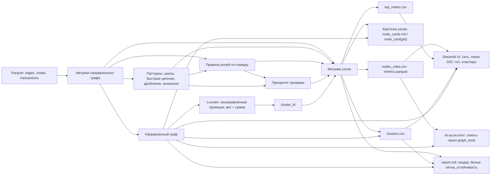

# Архитектура решения

- **Входные данные** — `data/edges.parquet`, `data/nodes.parquet` и `data/transactions.parquet`.
- **Метрики** — направленные входы и выходы, суммы и количество переводов, временные признаки, PageRank, betweenness и близость к seed.
- **Паттерны** — отдельно рассчитывают возвратные циклы, быстрые цепочки, возможное дробление и аномалии. Они добавляют свидетельства в `evidence` и компонент в приоритет; сами по себе не меняют критерии присвоения роли. Цикловой показатель структурный: суммирует минимальные веса рёбер найденных циклов и не доказывает прохождение тех же денег по кругу.
- **Роли** — первое сработавшее правило из `docs/roles.md` назначает роль и код `rule`. На четвёртом колене `P-trunc` назначается как периферийная роль, если более раннее правило не сработало; отсутствие выгруженных исходящих само по себе не означает конечного получателя.
- **Приоритет** — комбинирует вес роли, перцентили оборота, числа seed в двух шагах, PageRank и betweenness, а также долю сработавших паттернов. Веса заданы в `pipeline/config.py`.
- **Кластеры** — Louvain строится на ненаправленной проекции графа, где вес ребра равен сумме переводов. Кластер независим от правил ролей; его `cluster_id` присоединяется к строке узла, а `clusters.csv` дополняет кластеры направленной сводкой ролей и внутренних потоков.
- **Результаты** — `nodes_roles.csv` и `metrics.parquet` содержат строки по узлам; `top_nodes.csv` — верхние 30 по приоритету; `node_cards.md` — карточки первых 20; `clusters.csv` — сводка групп; `report.md` — агрегаты, белые пятна и сценарная устойчивость.
- **UI** — `ui/app.py` загружает выходные таблицы и `data/edges.parquet`; карточка из `ui/aml/card.py` использует `pipeline.cards.node_card` и также требует `data/nodes.parquet` и `outputs/metrics.parquet`. Во вкладках **Сеть** и **Топ приоритетов** карточка включает объяснение роли, метрики, паттерны, предупреждение об обрыве выгрузки и таблицы входящих/исходящих переводов. Клик по строке контрагента в таблице переводов реализован как переход к его GID; отдельная проверка этого действия не проводилась. Граф показывает до 300 узлов, но это не меняет полные таблицы данных. Онлайн-рендер графа проверялся в браузере на `fa4adc4`; текущий browser render и offline render не подтверждены. CSV и `report.md` остаются резервом.
- **Инструменты AI** — `harness/tools/graph_tools.py` регистрирует `node_card`, `neighbors`, `path`, `top_by_role` и `common_receivers`; все пять зарегистрированы и напрямую выполнены на данных. Живые вызовы модели не проверены. Проверка UI с заглушкой `load_dotenv`, устанавливающей тестовую переменную перед проверкой ключа, подтвердила отображение поля чата; `.env` не читали, запрос к провайдеру не выполняли. UI вызывает `load_dotenv()` перед проверкой `OPENAI_API_KEY` или `NVIDIA_API_KEY`.
