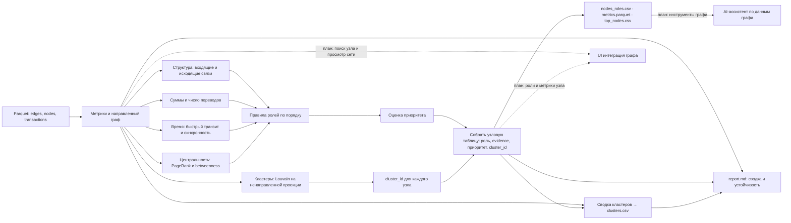

# Архитектура решения

- **Parquet** — входные таблицы рёбер, узлов и транзакций из `data/`.
- **Метрики** — структурные, денежные, временные признаки и центральность каждого узла.
- **Правила ролей** — последовательно определяют роль и записывают код правила и evidence.
- **Оценка приоритета** — ранжирует узлы для проверки по роли, обороту, близости к seed и центральности.
- **Кластеры** — Louvain рассчитывается отдельно от правил ролей по ненаправленной проекции с весом ребра по сумме. Для `clusters.csv` сводка использует также направленный граф и узловые роли; `cluster_id` возвращается в таблицу каждого узла.
- **Выгрузки и отчёт** — узловые CSV/Parquet, отдельная сводка `clusters.csv` и Markdown-отчёт с агрегатами и оценкой устойчивости.
- **Отчёт** — сводка кластеров и ролей, а также сценарная устойчивость направленного графа при удалении top-узлов.
- **Пунктирные связи** — целевая интеграция графа, ролей и метрик узла в UI и инструменты ассистента; в текущем приложении её ещё нет.
