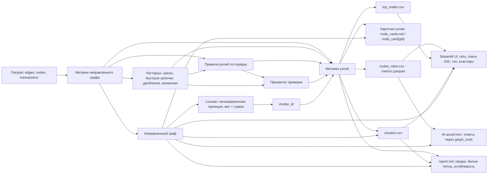

# Архитектура решения

- **Входные данные** — `data/edges.parquet`, `data/nodes.parquet` и `data/transactions.parquet`.
- **Метрики** — направленные входы и выходы, суммы и количество переводов, временные признаки, PageRank, betweenness и близость к seed.
- **Паттерны** — отдельно рассчитывают возвратные циклы, быстрые цепочки, возможное дробление и аномалии. Они добавляют свидетельства в `evidence` и компонент в приоритет; сами по себе не меняют критерии присвоения роли. Цикловой показатель структурный: суммирует минимальные веса рёбер найденных циклов и не доказывает прохождение тех же денег по кругу.
- **Роли** — первое сработавшее правило из `docs/roles.md` назначает роль и код `rule`. На четвёртом колене `P-trunc` назначается как периферийная роль, если более раннее правило не сработало; отсутствие выгруженных исходящих само по себе не означает конечного получателя.
- **Приоритет** — комбинирует вес роли, перцентили оборота, числа seed в двух шагах, PageRank и betweenness, а также долю сработавших паттернов. Веса заданы в `pipeline/config.py`.
- **Кластеры** — Louvain строится на ненаправленной проекции графа, где вес ребра равен сумме переводов. Кластер независим от правил ролей; его `cluster_id` присоединяется к строке узла, а `clusters.csv` дополняет кластеры направленной сводкой ролей и внутренних потоков.
- **Результаты** — `nodes_roles.csv` и `metrics.parquet` содержат строки по узлам; `top_nodes.csv` — верхние 30 по приоритету; `node_cards.md` — карточки первых 20; `clusters.csv` — сводка групп; `report.md` — агрегаты, белые пятна и сценарная устойчивость.
- **UI** — `ui/app.py` читает выходные таблицы и `data/edges.parquet`. Вкладки: **Сеть** (метрики, направленный интерактивный граф, фильтры по ролям и кластеру, поиск GID, карточка с входящими и исходящими связями), **Топ приоритетов**, **Кластеры** и **AI-ассистент**. Граф PyVis/vis-network проверен в браузере онлайн: для консолидатора видны цветные узлы и направленные стрелки. Офлайн-рендеринг графа не проверен; при отсутствии сети интерактивная визуализация может быть недоступна, а CSV и `report.md` остаются резервом. При переходе от одного GID к другому поле поиска может один раз вернуть прежнее значение; повторно введите полный GID. При очистке текста выбранный ранее GID остаётся в состоянии приложения. Табличные выгрузки и карточки также доступны из файлов.
- **Инструменты AI** — `harness/tools/graph_tools.py` регистрирует `node_card`, `neighbors`, `path`, `top_by_role` и `common_receivers`; все пять зарегистрированы и напрямую выполнены на данных. Живые вызовы модели не проверены. Сам интерфейс вкладки доступен без ключа; обращение к модели включается только при наличии `OPENAI_API_KEY` или `NVIDIA_API_KEY` в окружении процесса. Код UI проверяет переменные окружения до того, как конфигурация harness загружает `.env`, поэтому одного наличия ключа в `.env` недостаточно, если переменная не экспортирована в процесс.
